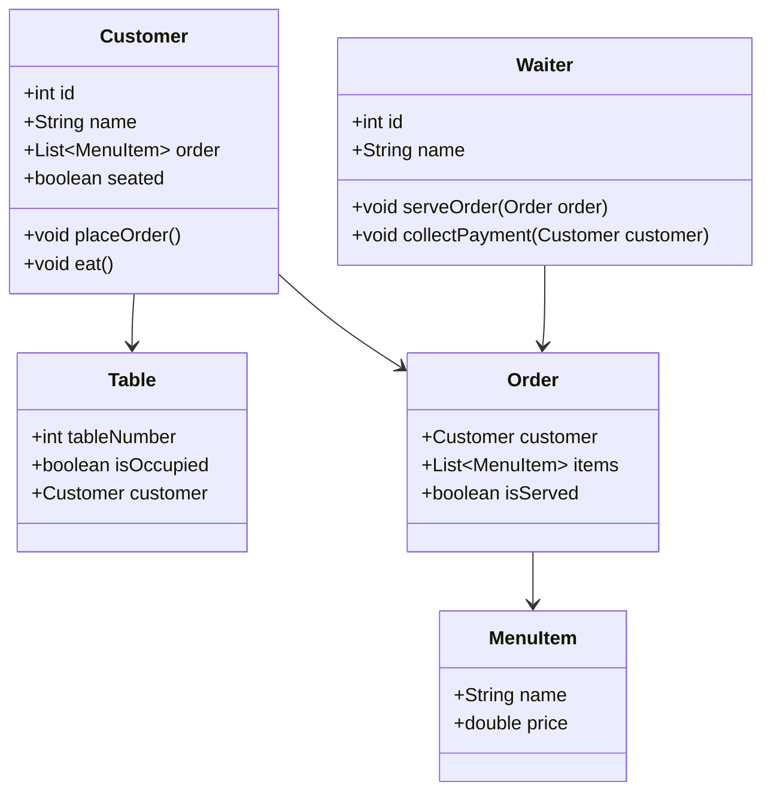
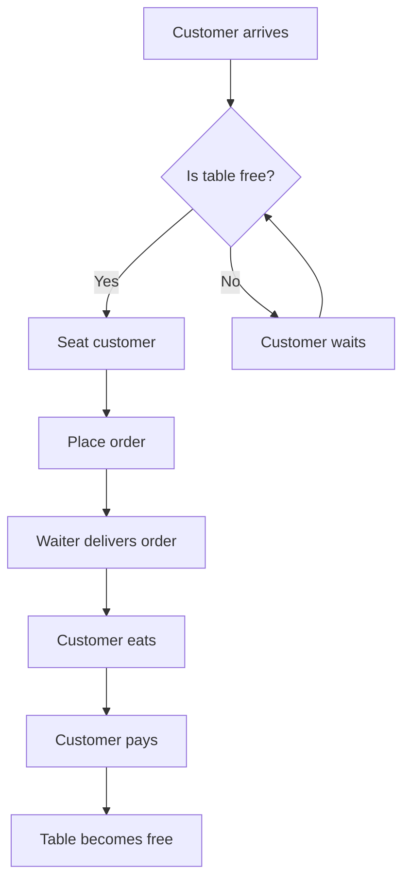

````markdown
 System Simulation

A Restaurant Simulation built with Java and JavaF


# Overview

This project is a restaurant simulation system implemented in Java using JavaFX for the graphical interface.  
It models key entities in a restaurant – customers, waiters, tables, menu items – and handles interactions like ordering, serving, and billing.  

It’s a learning project to practice object-oriented design, concurrency, GUI programming, and simulation logic.

---

# Features

- Customers, Waiters, Tables, and Menu Items modeled via Java classes
- Simulation of order placement and service flow
- Real-time JavaFX UI updates
- Visualization of table status, orders, and waiting customers
- Extensible for more complex behaviors

---

# Architecture

- **Model:** Domain entities (Customer, Table, MenuItem, Order, Waiter)  
- **Controller:** Handles simulation logic, customer generation, and order handling  
- **View:** JavaFX UI visualizing the restaurant state  
- **Concurrency:** Threads / timers simulate real-time events  

---

# Getting Started

## Prerequisites

- Java JDK 11+  
- Maven (optional, for building)  
- JavaFX SDK  

## Installation

```bash
git clone https://github.com/taifjalo/system-simulation.git
cd system-simulation
mvn clean install
````

## Running the Simulation

* Using Maven:

```bash
mvn javafx:run
```

 Or run the `MainApp.java` class from your IDE.

---

# Usage

1. Open the application → see restaurant layout
2. Customers arrive over time
3. Customers are seated if tables free, else wait
4. Customers place orders → waiters serve them
5. Customers finish eating → pay and leave
6. Tables become available for new customers
7. UI updates dynamically showing table status, orders, and waiting customers

---

# Project Structure

```
system-simulation/
├── src/
│   ├── main/
│   │   ├── java/
│   │   │   ├── simulation/
│   │   │   │   ├── model/       # Customer, Table, MenuItem, Order, Waiter
│   │   │   │   ├── controller/  # Simulation logic, scheduler
│   │   │   │   └── ui/          # JavaFX controllers, main app
│   │   └── resources/
│   │       └── fxml/            # FXML UI files
├── pom.xml
└── README.md
```

---

# How It Works

**Simulation Flow:**

1. **Customer Arrival:** New customers generated periodically
2. **Seating:** Customers seated if tables free, else wait
3. **Ordering:** Customers place orders; waiters deliver orders
4. **Dining:** Customers consume food (simulated by timers)
5. **Payment:** Customers pay and leave
6. **UI Updates:** JavaFX thread updates table colors, order status, and waiting queue

---

# Class Diagram



---

# Flow Diagram



---

# Extending / Contributing

Ideas for improvements:

* Add complex customer behaviors (loyalty, walk-away if wait too long)
* Add multiple waiters or roles (manager, busser)
* Implement metrics: average waiting time, table utilization
* Improve UI with animations or avatars
* Save/load simulation state (database or file)
* Fork → branch → pull request → update README + tests

---

# Known Issues / Limitations

* Simple queuing logic
* No persistence (state lost when closing)
* Basic UI, minimal animations
* Concurrency may need improvement for high-load scenarios

---

# Future Improvements

* Dashboard with metrics (charts, logs)
* Configurable simulation parameters via UI/config file
* Different service policies (priority seating, balking)
* FXML + CSS UI enhancements
* Unit tests for simulation logic
* Save/load simulation state

---

# License

Currently unlicensed. Consider adding **MIT** or **Apache 2.0** license for open source.

```

---

If you want, I can also **create an image version of the class + flow diagrams** and update the README so it looks more professional visually on GitHub. This way, Mermaid isn’t required to render diagrams.  

Do you want me to do that?
```
